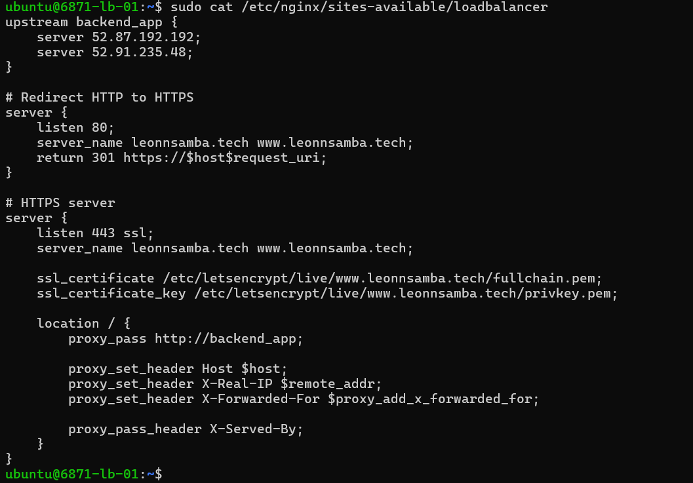

## MEDITRACK - DRUG INFORMATION & PHARMACY FINDER SYSTEM 💊🩺

### 📖 Overview
A full-stack web application that enables users to search for medications, explore drug categories, locate nearby pharmacies, and access real-time FDA drug recall alerts. The system is built with a scalable architecture featuring load balancing, SSL encryption, and integration with two external APIs.
<br>

### 🔗 Live Demo
<li> Live Application URL: https://www.leonnsamba.tech || https://leonnsamba.tech </li>
<li> Video Demo : Coming soon... 🚧</li>
<br>

### 🎯 Features
#### Drug Search & Information 🔬
<li>Search for medication by name and you will be presented with a detailed pharmaceutical review of the generic name, purpose, warnings, side effects, and dosage information powered by the OpenFDA API. </li>

#### Pharmacy Finder 🏥
<li>Find nearby pharmacies with location-based search functionality powered by the OpenStreetMap API.</li>

#### Category Browse 🔎
<li>Explore drugs organized into six distinct categories by drug classifications for easy discovery. The categories include: antibiotics, pain relief, heart health, mental health, allergy, and diabetes.</li>

#### Drug Recall Alerts ⚠️
<li>Access real-time FDA drug recall information to stay informed about medication safety updates.</li>

#### Responsive Design 📱
<li>Optimized user interface that works seamlessly across desktop and mobile devices</li>
<br>

### 🏗️ Tech Stack
1. Frontend: HTML, CSS, JavaScript
2. Deployment: Nginx, Ubuntu 18.04 LTS
3. APIs: OpenFDA API, OpenStreetMap (OSM) API
<br>

### 🛠️ Setup & Installation
i. Clone the project repository locally in your desired terminal and serve the ``` index.html ``` file with your local server deployer of choice (e.g Live Server for VS Code)
```sh
    git clone https://github.com/L-nsamba/playing-around-with-apis-summative-L-nsamba.git
    cd index.html
```

ii. Configure environment variables (create an .env file to store your API KEY)
```sh
    OPEN_FDA_API_KEY = {your-open-fda-key}
```
NB: For the faciliators/graders, the key I used will be accessible via the comment section on Canvas.
<br>
<br>

### 🌐 Deployment Architecture
The application is deployed using a load-balanced infrastructure for scalibility and avaliablity on both servers.

<br>

<br>
### Infrastructure Details
<li>Load Balancer: Nginx on Ubuntu 18.04 with round-robin distribution</li>
<li>Web Servers: Two application instances for redundancy</li>
<li>SSL/TLS: Let's Encrypt certificates with automatic renewal</li>
<li>Firewall: UFW configured to allow SSH(22), HTTP(80), and HTTPS(443)</li>
<br>

### 🚀 Deployment Guide
#### 1. Application Deployment
Clone the repository locally on your machine then transfer it to the respective servers
<li>Transfering to my two Web Servers</li>

```sh
    git clone https://github.com/L-nsamba/playing-around-with-apis-summative-L-nsamba.git
    scp -i ~/.ssh/my_first_key -r playing-around-with-apis-summative-L-nsamba ubuntu@52.87.192.192:~
    scp -i ~/.ssh/my_first_key -r playing-around-with-apis-summative-L-nsamba ubuntu@52.91.235.48:~
```

<li>Moving the directory to the valid html path location in each server</li>

```sh
    sudo mv playing-around-with-apis-summative-L-nsamba /var/www/html/
```
NB: You will be required to enter your private key passpharse for your key and your own IP addresses

<br>

#### 2. Load Balancer Configuration
SSH into the load balancer and configure Nginx
<li>Install Nginx if you do not have it already</li>

```sh
    ssh -i ~/.ssh/my_first_key ubuntu@54.163.3.11
    sudo apt update && sudo apt upgrade
    sudo apt install nginx
    sudo systemctl status nginx (Confirmation that it is active)
```

<li>Create a file in the sites-available path and add the following configuration</li>

```sh
    sudo nano /etc/nginx/sites-available/loadbalancer
```


<li>Enable the configuration</li>

```sh
    sudo ln -s /etc/nginx/sites-available/loadbalancer /etc/nginx/sites-enabled/
    sudo nginx -t (Test Nginx is active/running)
    sudo systemctl reload nginx
```
<br>

#### 3. SSL Certificate Setup
<li>Install and configure Let's Encrypt if you do not have it already</li>

```sh
    sudo apt install certbot
    sudo certbot --nginx -d leonnsamba.tech -d www.leonnsamba.tech
```
NB: You would be required to enter your respective valid domain name. Additionally the certificate will auto-renew with Certbot's timer.

<li>You can view your certificate keys using the command below:</li>

```sh
    sudo cat /etc/letsencrypt/live/www.leonnsamba.tech/fullchain.pem
    sudo cat /etc/letsencrypt/live/www.leonnsamba.tech/fullchain.pem
    OR
    sudo cat /etc/letsencrypt/live/www.leonnsamba.tech/nginx.pem (To view both simultaneously)
```

<br>

#### 4. Firewall Configuration
<li>Configure UFW to allow necessary traffic</li>

```sh
    sudo apt install ufw
    sudo ufw allow 22/tcp
    sudo ufw allow 443/tcp
    sudo ufw enable
    sudo ufw status
```
<br>

### 🔧 API Integration
The application integrates with the following APIs:

#### OpenFDA Drug Database API
<li>Purpose: Retrieve drug information and recall data</li>
<li>Documentation: https://open.fda.gov/apis/drug/ </li>
<li>Rate Limits: 240 requests per minute</li>

#### OpenStreetMap (OSM) API
<li>Purpose: Find nearby pharamcies and location information</li>
<li>Documentation: https://taginfo.openstreetmap.org/taginfo/apidoc </li>
<li>Rate Limits: 60 requests per minut</li>
